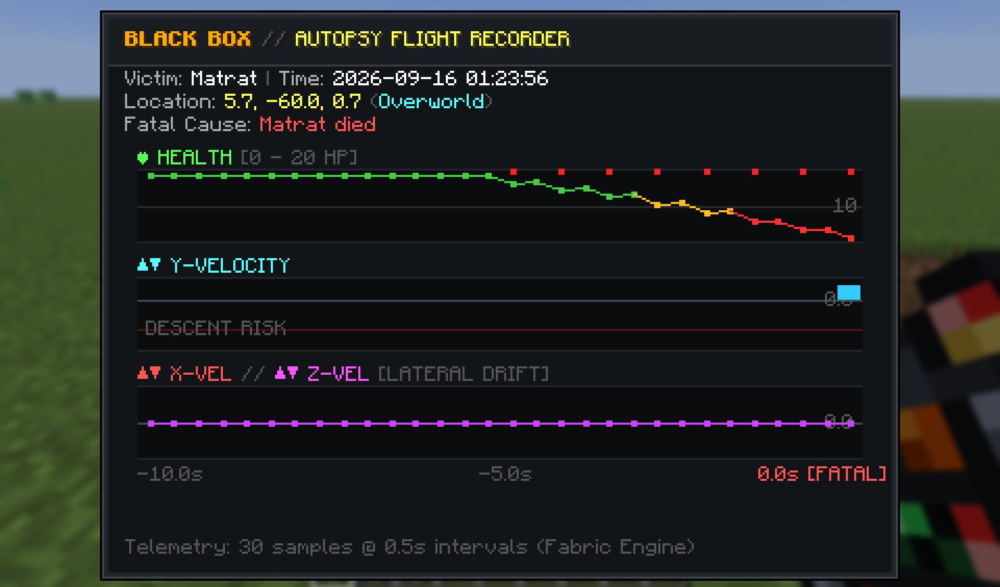
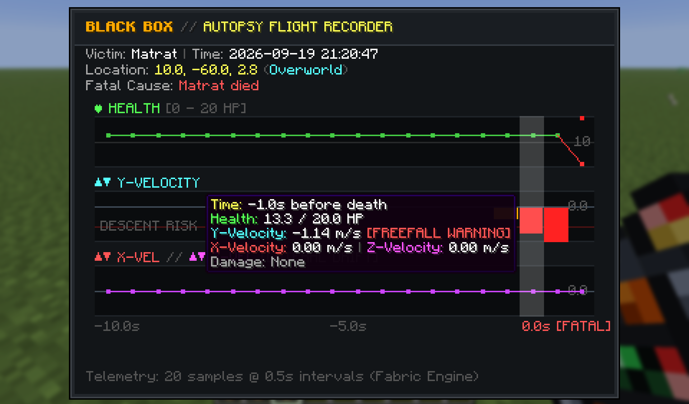

# Death Telemetry

Death Telemetry is a server-and-client Fabric mod for Minecraft 26.3 that captures pre-mortem telemetry in a zero-overhead rolling ring buffer. When a player dies, an invulnerable Autopsy Report "Black Box" item drops at the exact point of death. Right-clicking the item opens an authentic, interactive flight recorder HUD that visualizes the victim's final 10 seconds.

---


Telemetry report after taking damage from a Zombie. 


Telemetry report after free falling.

---

## Features

- **Pre-Mortem Flight Recording**: Continuously tracks vital signs and movement trajectories during the final 10 seconds leading up to death (20 snapshots sampled at 2 Hz / every 10 ticks).
- **Invulnerable Autopsy Report Drop**: Spawns an item at the exact death coordinates that is completely immune to lava, fire, and explosions, ensuring recovery in extreme death scenarios.
- **Interactive Telemetry Dashboard**:
  - **Health Graph**: A dedicated line graph tracking player health from 0 to 20 HP with distinct damage event tick markers.
  - **Y-Velocity Graph**: Visualizes vertical speed, fall rates, and jump arcs with ground velocity calibration and freefall warnings.
  - **X and Z Velocity Graph**: An overlapping dual-line graph displaying horizontal motion vectors (red for X-velocity, purple for Z-velocity) to analyze knockback and directional movement.
  - **Detailed Entity and Hazard Attribution**: Resolves the exact mob or player attacker (such as Zombie, Skeleton, Creeper, or custom-named mobs), projectile types, or environmental hazard names (such as Fire, Lava, Fall, The Void, Drowning, etc.).
  - **Interactive Hover Inspection**: Hover over any column on the telemetry timeline to view exact values for that half-second window, including time before death, health, velocity components, and damage breakdown.

---

## Requirements

- **Minecraft**: 26.3
- **Mod Loader**: Fabric Loader (>= 0.19.5)
- **Fabric API**: Installed for Minecraft 26.3
- **Java**: 25

---

## Installation

### Client Installation
1. Install Minecraft 26.3 with Fabric Loader.
2. Download `death-telemetry-1.0.0.jar` from the GitHub Releases page.
3. Download the matching **Fabric API** for Minecraft 26.3.
4. Place both `.jar` files into your `.minecraft/mods` directory:
   - **Windows**: `%appdata%\.minecraft\mods`
   - **macOS**: `~/Library/Application Support/minecraft/mods`
   - **Linux**: `~/.minecraft/mods`
5. Launch Minecraft using the Fabric profile.

### Server Installation
1. Set up a Minecraft 26.3 dedicated server using Fabric Loader.
2. Place `death-telemetry-1.0.0.jar` and the Fabric API jar into the server's `mods/` directory.
3. Restart the server.

*Note: While Death Telemetry operates server-side to record telemetry data and drop the black box, clients must also have the mod installed to open and view the interactive telemetry GUI.*

---

## In-Game Usage

### Obtaining the Black Box
- **Survival Gameplay**: Whenever a player dies, an Autopsy Report black box is automatically dropped at their death location. The item is invulnerable and will not burn in lava or be destroyed by explosions.
- **Commands**: Operators can generate test reports using:
  ```text
  /give @p death_telemetry:autopsy_report
  ```

### Inspecting the Report
1. Place the `Autopsy Report` into your main hand.
2. **Right-Click** to open the telemetry screen.
3. Review the header details (victim name, timestamp, death coordinates, dimension, fatal cause).
4. Analyze the three telemetry graphs (Health, Y-Velocity, X & Z Velocities).
5. Move the cursor horizontally across the graphs to inspect granular data for each point in time.

---

### To-DO
1. Make the Autopsy Report item craftable for situations where it is unrecoverable.
2. Add a config file to change preferences. 
3. Create a menu to analyze from every death in the world.
4. Add a more interactive and fun way to view data. 

---

### Use in Projects
You are free to use this mod in any modpack or compilation and may also share this product in any way adhering to the MIT License. If you do use this pack in another project or modpack, please provide credit to me, thanks. :)

<script type="text/javascript" src="https://cdnjs.buymeacoffee.com/1.0.0/button.prod.min.js" data-name="bmc-button" data-slug="MatthewShkolnik" data-color="#FFDD00" data-emoji=""  data-font="Lato" data-text="Buy me a coffee" data-outline-color="#000000" data-font-color="#000000" data-coffee-color="#ffffff" ></script>

---

## License

This project is licensed under the MIT License. See the [LICENSE](LICENSE) file for details.
